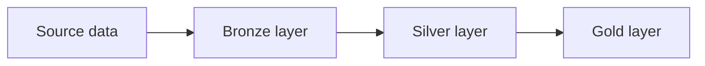
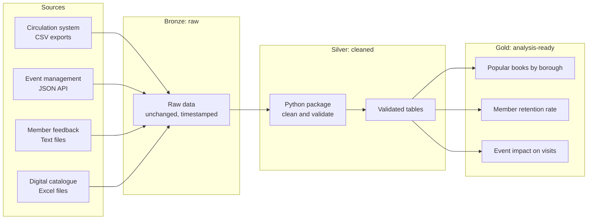

# Pipeline Architecture Diagram
# Library Pipeline

```mermaid

flowchart LR
    Source[Source data] --> Bronze[Bronze layer]
    Bronze --> Silver[Silver layer]
    Silver --> Gold[Gold layer]


```

```mermaid
flowchart LR
  subgraph SRC["Sources"]
    S1["Circulation system<br/>CSV exports"]
    S2["Event management<br/>JSON API"]
    S3["Member feedback<br/>Text files"]
    S4["Digital catalogue<br/>Excel files"]
  end

  subgraph BRONZE["Bronze: raw"]
    B1["Raw data<br/>unchanged, timestamped"]
  end

  subgraph SILVER["Silver: cleaned"]
    S5["Python package<br/>clean and validate"]
    S6["Validated tables"]
    S5 --> S6
  end

  subgraph GOLD["Gold: analysis-ready"]
    G1["Popular books by borough"]
    G2["Member retention rate"]
    G3["Event impact on visits"]
  end

S1 --> B1
  S2 --> B1
  S3 --> B1
  S4 --> B1
  B1 --> S5
  S6 --> G1
  S6 --> G2
  S6 --> G3

 
```
